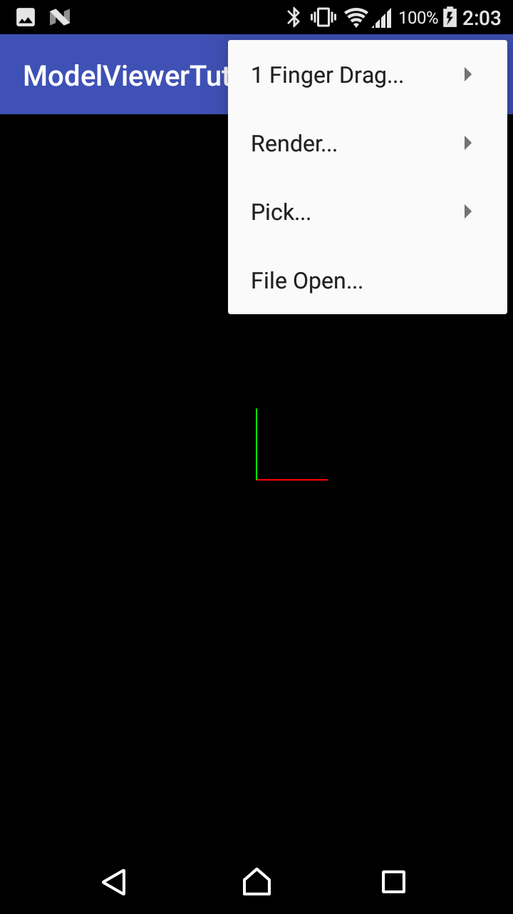
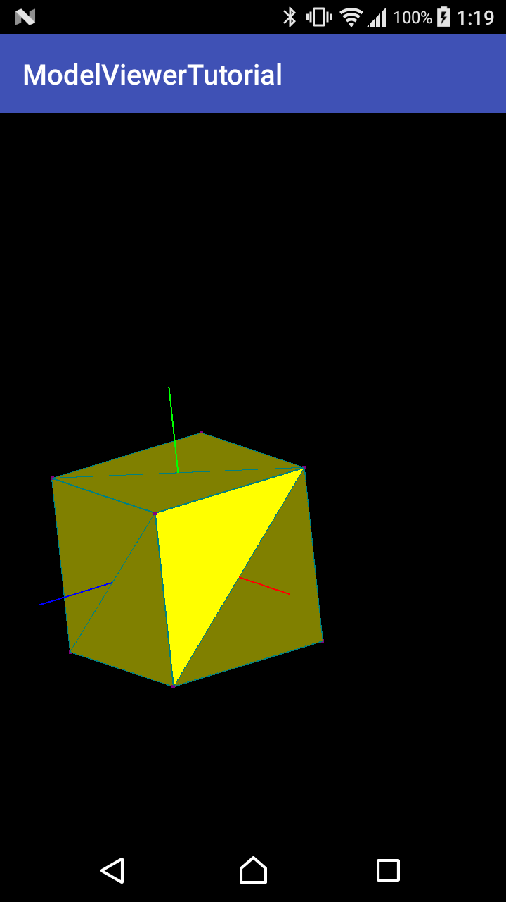
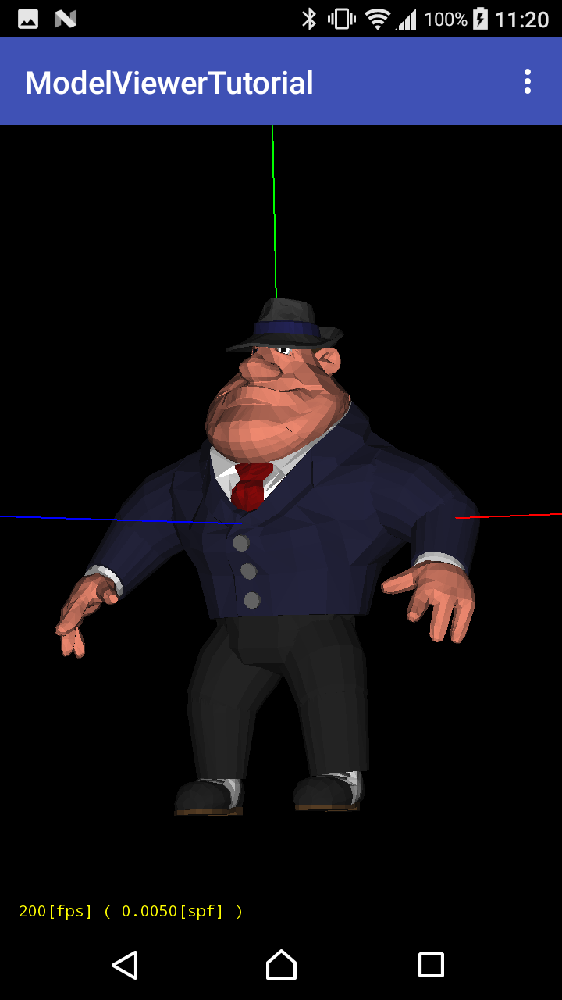
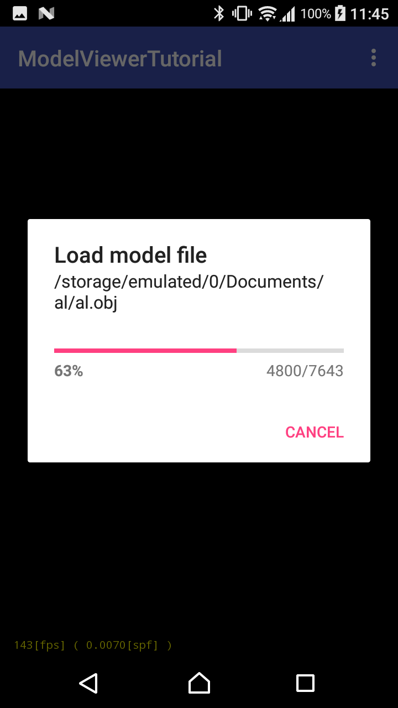

# ModelViewerTutorial
モデルビューアを作る ( Android + OpenGL ES 1.0/1.1 ) ( Android Studio 2.3.3 版 )
http://www.hiramine.com/programming/modelviewerandroidstudio233/index.html

## Screenshots : スクリーンショット
   

## Requirements : 必要条件、依存関係
- Android Studio 2.3.3
- Android SDK 19
- Android Build Tools v26.0.0
- Android Support Repository

## Author : 作者
Nobuki HIRAMINE : http://www.hiramine.com

## License : ライセンス
Copyright 2017 Nobuki HIRAMINE  
The source code is licensed under the Apache License, Version 2.0.  
See the [LICENSE](LICENSE) file for more details.  
(本アプリケーションのソースコードのライセンスは、「Apache License, Version 2.0」です。  
詳細は「[LICENSE](LICENSE)」ファイルを参照ください。)
